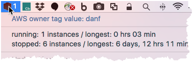

# Mac OS X menu bar AWS instance state watcher for Cloudera

### _Ever get busy and don't remember what AWS EC2<sup>[*](#footnote1)</sup> instances you have running:interrobang:_

#### Wouldn't it be nice to have a menubar item that shows the state of your instances in AWS? 



This project uses [BitBar](https://getbitbar.com), a freely available tool that displays the output of a script into a Mac OS X menubar item. The python program / executable in this project will query AWS EC2 for instances based on the Cloudera required owner tag.  
  
The execution is very lightweight, but I would not recommend going below 5 minutes. No particular reason outside of giving time for the AWS queries to run (which typically take less than 2 seconds), and it just feels right. I've been using a 10 minute interval configuration as descibed in [Script Usage](#script-usage). 

There also is a command line option for plain terminal output that displays the number EC2 instances and their state not formatted for bitbar dislpay.  

There's pre-built PyInstaller executable version of the python script for those that may run into issues with Python imports, etc. It's built with boto3 v1.4.2 because the latest version of the boto3 package does not seem to work with the latest version of PyInstaller. 

<a name="footnote1">*</a>_**AWS native instances, not Cloudcat instances**_

------
## Table of Contents

- [Script Usage](#script-usage)
- [Setup](#setup)
- [Install](#install)  
    + [Install BitBar](#a-install-bitbar)  
    + [Install Script or Binary](#b-install-script-or-prebuilt-binary)  
- [Run BitBar App](#run-bitbar)  
- [Notes](#notes)
- [Support](#support)
- [Contributing](#contributing)

## Script Usage

You will have to rename the downloaded python or packaged excutable file to reflect the time interval that BitBar will use to run the script / executable.  The interval is referenced as ```<refreshRate>``` below. The ```<refreshRate>``` syntax in the file name is used by BitBar to determine how often to run the script (e.g. file zyx.5m would be run by BitBar every 5 minutes, cba.5s every 5 seconds, etc.). The prefix name of the file can be anything.  Normal linux excutable rules apply. Scripts must be executable with a #!/... to set the interpreter, executables just need to be executabe. See the BitBar documentation for more details. 

There's two flavors provided here:
    1) python file
    2) pre-built python executable if you have problems with you python environment and imports, etc. 

*Python Script*  
```
usage: awsbitbar.<refreshRate>.py [-h] [-t]

optional arguments:
  -h, --help  show this help message and exit
  -t, --term  output is formatted for terminal output, not bibar
```
&nbsp;&nbsp;&nbsp; OR

*Pre-built Python Executable*  
```
usage: awsbitbar.<refresh rate> [-h] [-t]

optional arguments:
  -h, --help  show this help message and exit
  -t, --term  output is formatted for terminal output, not bibar
```

-----
## Setup

### Prerequisites and things you will need and are good to know

1. The code here only works because each Cloudera AWS users needs to tag their instances with an *owner* tag that matches their user name. In this case it's the $USER environment variable when you log into your Mac.  See end of the Readme if your owner tag does not match you Mac bash $USER variable

2. You will need a working AWS configuration that has credentials set so that no login is required. See AWS boto3 quickstart [documentation](http://boto3.readthedocs.io/en/latest/guide/quickstart.html). For example  ~/.aws/credentials would have the lines below with your credentials filled in:
```
  [default]
  aws_access_key_id = XXXXXX...ZZZZZ
  aws_secret_access_key =  XXXXXX...ZZZZZ
```
   
3. You'll need [BitBar](https://getbitbar.com), a nifty Mac OS X utility that creates a menu bar icon based on output of a program you choose.  Much nicer than having to write you're own app! The file name .postfix extensions determine how often the menu bar updates.


5. There is a parameter flag to get non-bitbar formatted text output that could be used for other O/S's, but I've only tested with Mac OS X. Let me know if you run into any issues.
    * Users will be responsible for resolving any package and library issues.

------

### Install

#### A Install BitBar

1. Download bitbar, unzip, and install by dragging to your Applications folder.  
    * Direct download is here: https://github.com/matryer/bitbar/releases/latest   
    Get the zip file named BitBar-v#.#.#.zip.
    * github is here: https://github.com/matryer/bitbar  
    
2. You will need to create a bitbar plugins directory to put the code file(s) it is going to run. e.g.
    ```
    mkdir ~/bitBbar
    ```   

#### B Install Script or Prebuilt Binary

#### *_If Using Python File_*
1. Install the boto3 and pytz Python packages

```
  pip install -r requirements.txt 
```

&nbsp;&nbsp;&nbsp;Try pip -- user install if get an error about boto3 or any other packages not found:

```
  pip install --user -r requirements.txt 
```
        Any virtualenv errors, etc. are past what we're trying to accomplish here.  

2. Download or copy / paste the file awsbitbar.10m.py from this respository into the plugin directory (e.g. ~/bitBar).   

3. Make the file executable
    ```
    chmod 777 ~/bitBar/awsbitbar.10m.py
    ```
    
4. Optionally rename the file with a refresh rate you want, e.g. to change from the default 10 minute refresh to 15 minutes rename the file:
    ```
    mv ~/bitBar/awsbitbar.10m.py ~/bitBar/awsbitbar.15m.py
    ```
    
#### *_If Using pre-built / packaged Binary_*
1. Download the file in the dist folder of this repository [here](/dist/awsbitbar.10m) into the plugin directory (e.g. ~/bitBar).  

2. Make the file executable
    ```
    chmod 777 ~/bitBar/awsbitbar.10m
    ```
    
3. Optionally rename the file with a refresh rate you want, e.g. to change from the default 10 minute refresh to 15 minutes rename the file:
    ```
    mv ~/bitBar/awsbitbar.10m ~/bitBar/awsbitbar.15m
    ```

## Run BitBar
1. Start BitBar
  * Open the BitBar application. Use the location you placed the python code or executable file (e.g. ~/bitBar) for the BitBar plug-in directory that BitBar will prompt for on the first run. You can change this in BitBar preferences later, or if you skipped this step on startup by:  
      + Click on the BitBar menubar app and choose Preferences->Change Plugin Folder.. Then choose Refresh, or &#8984;R.

*_NOTE:_* BitBar will attempt to run _any file_ it finds in the plugin folder  An invalid script will show an error in the menubar.

------

## Notes

* The menubar image will be red  followed by the number of AWS instances running with the owner tag = $USER. Otherwise, it will be grey  followed by the number of stopped instances for the AWS owner tag. ":no_entry_sign: 0 Instances" will be shown if no AWS instances with the owner=$USER tag are found.

* The owner tag is hard coded to use the $USER environment variable for the AWS query in the python code. To change:  
    
    _replace all instances of:_  
      ```[os.environ['USER']```  
  _with:_  
    ```'myAWSownerTagValue'```

* The executable download was created with the PyInstaller utility: 
    ```
    pyinstaller --clean --onefile --noupx awsbitbar.refreshRate.py
    ```  
    
* Can use the python script or pre-built executable with the -t option from the command line to get the same output without the bitbar formatting.
* Other stuff comming soon, maybe, like ability to add other tags to the query, alerting when running more than X hours or on weekends, write from scratch as a swift app. Whatever. Like I got nothing better to do with my time, but somebody else might. :cherries:

## Support

Please [open an issue](https://github.com/dfgit/AWS-Remind/issues/new) for support.

## Contributing

Please contribute using [Github Flow](https://guides.github.com/introduction/flow/). Create a branch, add commits, and [open a pull request](https://github.com/dfgit/AWS-Remind/compare/)
